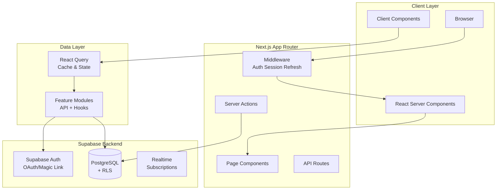
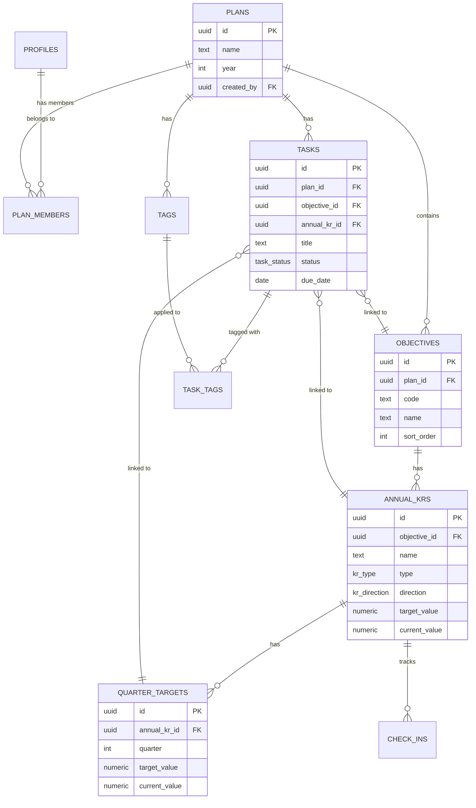
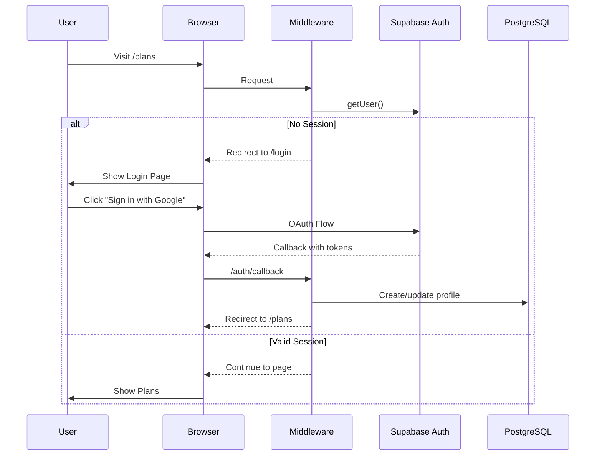

# Architecture Overview

## System Architecture Diagram



## Data Flow

### Read Flow (Queries)
```
User Action → React Query Hook → Feature API → Supabase Client → PostgreSQL
                  ↓
             Cache Check → Return Cached / Fetch Fresh
```

### Write Flow (Mutations)
```
User Action → React Query Mutation → Feature API → Supabase Client → PostgreSQL
                                                           ↓
                                                    DB Triggers
                                                           ↓
                                                  activity_events
                  ↓
           Invalidate Queries → Refetch Updated Data
```

## Core Data Model



## Key Abstractions

### 1. Progress Engine (`src/lib/progress-engine.ts`)

Pure functions for OKR progress computation:

```typescript
// Core types
type PaceStatus = "ahead" | "on_track" | "at_risk" | "off_track";

interface ProgressResult {
  currentValue: number;
  progress: number;        // 0-1
  expectedProgress: number; // 0-1 (time-based)
  paceRatio: number;       // actual/expected
  paceStatus: PaceStatus;
  forecastValue: number | null;
  daysRemaining: number;
}

// Key functions
computeKrProgress(kr, checkIns, tasks, planYear, asOfDate) → ProgressResult
computeQuarterProgress(quarterTarget, kr, checkIns, planYear) → QuarterProgressResult
computeObjectiveProgress(objective, krProgresses) → ObjectiveProgress
computePlanProgress(planId, objectiveProgresses) → PlanProgress
```

### 2. Feature Module Pattern

Each domain follows this structure:

```
src/features/tasks/
├── api.ts     # Supabase queries
├── hooks.ts   # React Query hooks
└── index.ts   # Re-exports
```

**API Layer** - Raw Supabase operations:
```typescript
// api.ts
export async function getTasks(planId: string, filters?: TaskFilters): Promise<Task[]> {
  const supabase = createClient();
  let query = supabase.from("tasks").select("*").eq("plan_id", planId);
  query = applyTaskFilters(query, filters);
  return handleSupabaseError(query);
}
```

**Hooks Layer** - React Query integration:
```typescript
// hooks.ts
export function useTasks(planId: string, filters?: TaskFilters) {
  return useQuery({
    queryKey: queryKeys.tasks.list(planId, filters),
    queryFn: () => api.getTasks(planId, filters),
    enabled: !!planId,
  });
}

export function useCreateTask(planId: string) {
  const queryClient = useQueryClient();
  const { toast } = useToast();

  return useMutation({
    mutationFn: (task: TaskInsert) => api.createTask({ ...task, plan_id: planId }),
    onSuccess: () => {
      queryClient.invalidateQueries({ queryKey: queryKeys.tasks.all });
      toast(successMessages.taskCreated);
    },
    onError: (error) => toast(formatErrorMessage(error)),
  });
}
```

### 3. Import/Export System (`src/features/import-export/`)

Data portability with schema validation:

```typescript
// Export schema v1.0 with cross-reference IDs
interface PlanExport {
  metadata: { version: "1.0", exportedAt, planId, planName, exportedBy };
  plan: { name, year, description };
  tags: ExportTag[];           // _exportId for references
  krGroups: ExportKrGroup[];
  objectives: ExportObjective[];  // Nested: annualKrs → quarterTargets
  tasks: ExportTask[];            // References via _exportId
  checkIns: ExportCheckIn[];
  weeklyReviews: ExportWeeklyReview[];
}

// Key functions
exportPlanToJson(planId) → PlanExport
exportPlanToMarkdown(data) → string
parseImportFile(content) → ImportPreview  // Zod validation
importPlanFromJson(content, options) → ImportResult
```

**Import Flow:**
1. Parse and validate JSON with Zod schemas
2. Preview: show entity counts and validation warnings
3. Options: skip check-ins, skip reviews, reset progress
4. Import: create entities in dependency order
5. ID Mapping: `Map<exportId, realDbId>` for references

**Cloud Backups:**
- Storage bucket: `plan-backups`
- Path pattern: `{userId}/{planId}/{planName}_{timestamp}.json`
- RLS: users can only access their own folder

### 4. Query Key Factory

Centralized cache key management:

```typescript
// src/lib/query-client.tsx
export const queryKeys = {
  tasks: {
    all: ["tasks"] as const,
    list: (planId: string, filters?: object) => 
      [...queryKeys.tasks.all, "list", planId, filters] as const,
    detail: (taskId: string) => 
      [...queryKeys.tasks.all, "detail", taskId] as const,
  },
  // ... other domains
};
```

### 4. UI Component System

Based on Radix UI primitives with CVA variants:

```typescript
// src/components/ui/button.tsx
const buttonVariants = cva(
  "inline-flex items-center justify-center gap-2 rounded-button...",
  {
    variants: {
      variant: {
        default: "bg-accent text-white hover:bg-accent-hover",
        secondary: "bg-bg-0 text-text-strong border border-border",
        ghost: "text-text-strong hover:bg-accent-muted",
        danger: "bg-status-danger text-white",
      },
      size: {
        default: "h-10 px-5 py-2",
        sm: "h-8 px-4 text-small",
        lg: "h-12 px-8 text-body",
      },
    },
  }
);
```

## Authentication Flow



## Row Level Security

All database tables use RLS policies based on plan membership:

```sql
-- Example: tasks table policy
CREATE POLICY "Users can view tasks in their plans" ON tasks
  FOR SELECT USING (
    plan_id IN (
      SELECT plan_id FROM plan_members 
      WHERE user_id = auth.uid()
    )
  );

CREATE POLICY "Editors can modify tasks" ON tasks
  FOR ALL USING (
    plan_id IN (
      SELECT plan_id FROM plan_members 
      WHERE user_id = auth.uid() 
      AND role IN ('owner', 'editor')
    )
  );
```

## Activity Event System

Automatic audit trail via PostgreSQL triggers:

```sql
-- Trigger function (simplified)
CREATE FUNCTION log_activity_event() RETURNS TRIGGER AS $$
BEGIN
  INSERT INTO activity_events (
    plan_id, user_id, entity_type, entity_id,
    event_type, old_data, new_data
  ) VALUES (
    NEW.plan_id, auth.uid(), TG_ARGV[0], NEW.id,
    TG_OP, row_to_json(OLD), row_to_json(NEW)
  );
  RETURN NEW;
END;
$$ LANGUAGE plpgsql;

-- Applied to tables
CREATE TRIGGER tasks_activity
  AFTER INSERT OR UPDATE OR DELETE ON tasks
  FOR EACH ROW EXECUTE FUNCTION log_activity_event('task');
```

## Integration Points

### External Services
- **Supabase Auth**: OAuth (Google) and Magic Link authentication
- **Supabase Storage**: Cloud backups for plan data (`plan-backups` bucket)
- **Supabase Realtime**: (Potential) Live collaboration features

### Internal Integration
- **Progress Engine** ↔ **Analytics**: Progress data feeds charts
- **Tasks** ↔ **Check-ins**: Task completion can trigger check-ins
- **Activity Events** ↔ **Timeline**: All changes logged for audit
- **Weekly Reviews** ↔ **Progress**: Snapshots progress at review time
- **Import/Export** ↔ **All Entities**: Full plan backup and restore

## Performance Considerations

### Query Optimization
- Indexes on frequently filtered columns (plan_id, status, due_date)
- Composite indexes for common query patterns
- Partial indexes for active tasks

### Client-Side Caching
- React Query with 1-minute stale time
- 5-minute garbage collection time
- Automatic background refetch on window focus (production)

### Database Views
Pre-computed views for complex aggregations:
- `v_objective_progress` - Objective progress with KR counts
- `v_kr_progress` - KR progress calculations
- `v_plan_stats` - Plan-level statistics
- `v_weekly_review_summary` - Review status summaries

## Scalability Notes

### Current Design Limits
- Single Supabase project
- Client-side rendering for complex pages
- No server-side pagination by default

### Future Scaling Options
- Edge Functions for heavy computations
- Database read replicas for analytics
- CDN caching for static assets
- Background jobs for weekly review generation
